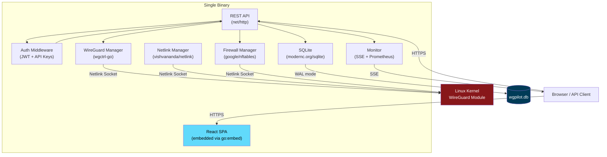
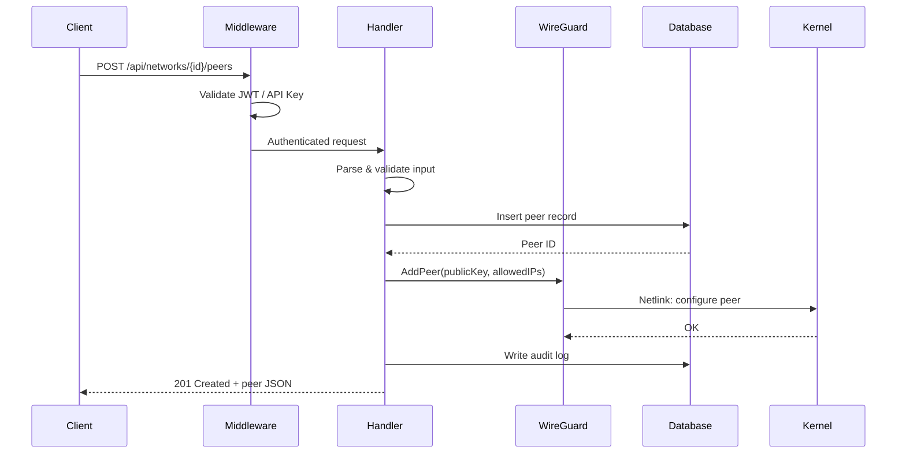
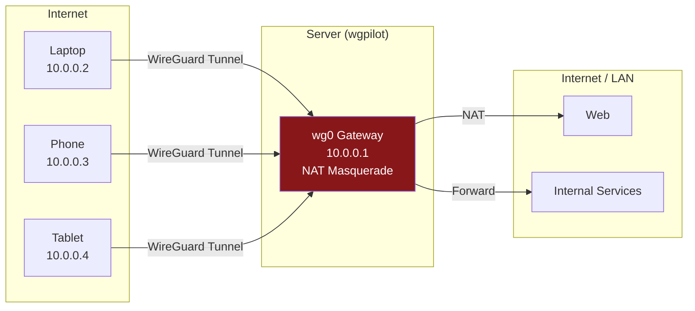
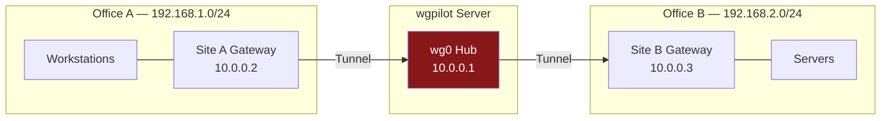
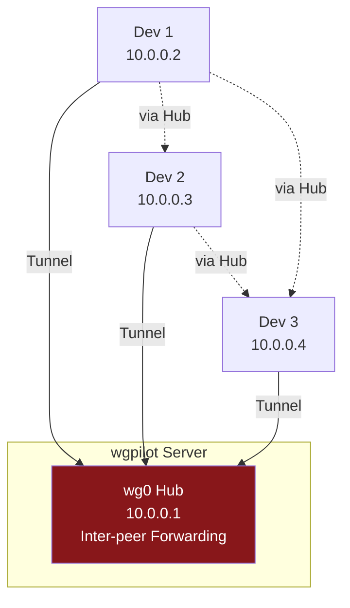
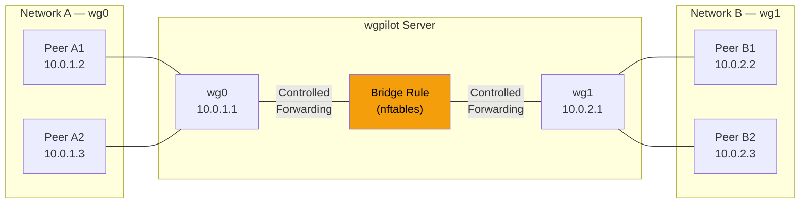

<p align="center">
  <strong>wgpilot</strong><br>
  Self-hosted WireGuard management with a modern web UI.<br>
  Single binary. No shell-outs. No external dependencies.
</p>

<p align="center">
  <a href="https://github.com/itsChris/wgpilot/releases"></a>
  <a href="https://github.com/itsChris/wgpilot/blob/master/LICENSE"></a>
  <a href="https://goreportcard.com/report/github.com/itsChris/wgpilot"></a>
  
  
</p>

---

<!-- TODO: Add a screenshot of the dashboard here -->
<!--  -->

## Why wgpilot?

Most WireGuard management tools shell out to `wg`, `ip`, and `iptables` and parse their text output. wgpilot takes a different approach:

| | wgpilot | wg-easy | Firezone | Netbird |
|---|---|---|---|---|
| Shell-outs to wg/ip/iptables | **None** (kernel API) | Yes | Yes | Yes |
| Single binary | **Yes** | Docker only | Multi-container | Multi-container |
| Multi-network | **Yes** (3 topology modes) | No | Yes | Yes (mesh) |
| Network bridging | **Yes** | No | No | No |
| Encrypted key storage | **AES-256-GCM** | Plaintext | Depends | N/A |
| Self-contained DB | **SQLite** | JSON file | PostgreSQL | PostgreSQL |
| RBAC (multi-user) | **Yes** | No | Yes | Yes |
| API keys | **Yes** | No | Yes | Yes |
| Audit log | **Yes** | No | Yes | Yes |
| Setup effort | **curl + init** | docker run | Docker + DB | Docker + DB + STUN |

wgpilot is ideal if you want a **lightweight, secure, self-contained** WireGuard manager that runs natively on Linux without Docker or external databases.

## Features

### Core
- **Single binary** -- Go server + embedded React SPA + SQLite + TLS termination
- **Kernel-native** -- Uses `wgctrl-go`, `netlink`, and `nftables` directly (zero shell-outs)
- **Reconciliation** -- On startup, reconciles kernel WireGuard state against the database
- **Setup wizard** -- Browser-based 4-step setup with one-time password bootstrap

### Networking
- **Multi-network** -- Manage multiple WireGuard interfaces with independent subnets
- **3 topology modes** -- VPN gateway, site-to-site, and hub-routed (see [Topologies](#topologies))
- **Network bridging** -- Cross-network forwarding rules via nftables kernel API
- **Automatic IP allocation** -- Concurrent-safe IP assignment from configured subnets
- **Config export** -- Download wg-quick compatible server configs
- **wg-quick import** -- Import existing WireGuard configurations during setup

### Security
- **JWT auth** with HttpOnly/Secure/SameSite cookies
- **Multi-user RBAC** -- Admin and viewer roles
- **API keys** -- Bearer token auth for automation (`wgp_...` prefix)
- **Encrypted private keys** -- AES-256-GCM at rest, derived from JWT secret
- **Rate-limited login** -- 5 attempts per minute per IP
- **Audit log** -- Every mutating operation logged with user, IP, and timestamp
- **Security headers** -- CSP, HSTS, X-Frame-Options, X-Content-Type-Options

### Monitoring
- **Real-time dashboard** -- Live peer status via Server-Sent Events (SSE)
- **Prometheus metrics** -- `wg_peers_total`, `wg_transfer_bytes_total`, `wg_peer_last_handshake_seconds`, etc.
- **Alert rules** -- Configurable alerts for peer offline, interface down
- **Transfer history** -- Historical RX/TX data with automatic compaction
- **Diagnostic CLI** -- `wgpilot diagnose` for system health checks

### Operations
- **TLS** -- ACME (Let's Encrypt), self-signed, or manual certificates
- **Self-updater** -- Check and apply updates from GitHub releases
- **Backup/restore** -- CLI commands for database backup and recovery
- **Peer expiry** -- Optional expiration dates with automatic peer disable
- **Docker support** -- Dockerfile + docker-compose included
- **systemd integration** -- Type=notify with watchdog support

## Architecture



### Request Flow



## Topologies

wgpilot supports three network topology modes out of the box:

### VPN Gateway (Remote Access)



All client traffic routed through the server with NAT masquerading. Ideal for remote access VPN and privacy tunnels.

### Site-to-Site



Each peer represents a site gateway. Traffic is routed between office LANs through the WireGuard hub.

### Hub with Peer Routing (Team Mesh)



Clients can reach each other through the hub server. No NAT, no direct internet routing. Ideal for development teams and internal networks.

### Network Bridging



Connect separate WireGuard networks with controlled forwarding rules. Supports unidirectional and bidirectional bridging with optional CIDR filtering.

## Quick Start

### Install

```bash
# Download the latest release
curl -fsSL https://github.com/itsChris/wgpilot/releases/latest/download/wgpilot-linux-amd64 \
  -o /usr/local/bin/wgpilot
chmod +x /usr/local/bin/wgpilot
```

### Initialize

```bash
# Create data directory and initialize the database
sudo wgpilot init --data-dir /var/lib/wgpilot
```

This generates a one-time setup password. Save it — you'll need it to complete setup via the web UI.

### Run

```bash
# Start the server
sudo wgpilot serve
```

Open `https://<server-ip>` in your browser and complete the setup wizard using the one-time password.

### Docker

```bash
# Using docker-compose
git clone https://github.com/itsChris/wgpilot.git
cd wgpilot
docker compose up -d
```

Or with `docker run`:

```bash
docker run -d \
  --name wgpilot \
  --network host \
  --cap-add NET_ADMIN \
  --cap-add SYS_MODULE \
  --sysctl net.ipv4.ip_forward=1 \
  -v wgpilot-data:/var/lib/wgpilot \
  -v /etc/wgpilot:/etc/wgpilot \
  --restart unless-stopped \
  ghcr.io/itschris/wgpilot:latest
```

### systemd Service

```ini
[Unit]
Description=wgpilot WireGuard Manager
After=network-online.target
Wants=network-online.target

[Service]
Type=notify
ExecStart=/usr/local/bin/wgpilot serve --config /etc/wgpilot/config.yaml
AmbientCapabilities=CAP_NET_ADMIN
WatchdogSec=60
Restart=on-failure
RestartSec=5

[Install]
WantedBy=multi-user.target
```

## CLI Reference

```
wgpilot serve              Start the HTTPS server
wgpilot init               Initialize database and generate setup credentials
wgpilot diagnose           Run system diagnostics (--json for machine output)
wgpilot update             Update to the latest release (--check for dry run)
wgpilot version            Print version, commit, and build date
wgpilot backup             Create a database backup
wgpilot restore            Restore database from a backup
wgpilot config check       Validate configuration file
wgpilot api-key create     Create an API key (--name, --role, --expires-in)
wgpilot api-key list       List all API keys
wgpilot api-key revoke     Revoke an API key by ID
```

### Global Flags

| Flag | Default | Description |
|------|---------|-------------|
| `--config` | `/etc/wgpilot/config.yaml` | Path to config file |
| `--data-dir` | `/var/lib/wgpilot` | Path to data directory |
| `--log-level` | `info` | Log level: debug, info, warn, error |
| `--dev-mode` | `false` | Enable development mode (debug logging, relaxed TLS) |

### API Keys

Create API keys for automation and scripting:

```bash
# Create an admin API key
sudo wgpilot api-key create --name "CI/CD" --role admin --expires-in 90d

# Create a read-only key
sudo wgpilot api-key create --name "monitoring" --role viewer

# List keys
sudo wgpilot api-key list

# Revoke a key
sudo wgpilot api-key revoke <key-id>
```

Use API keys with the `Authorization` header:

```bash
curl -H "Authorization: Bearer wgp_abc123..." https://your-server/api/networks
```

## Configuration Reference

Configuration is loaded with priority: CLI flags > environment variables > YAML file > defaults.

Environment variables use the `WGPILOT_` prefix with underscores replacing dots (e.g., `WGPILOT_SERVER_LISTEN`).

```yaml
server:
  listen: "0.0.0.0:443"       # Listen address
  dev_mode: false              # Development mode

database:
  path: "/var/lib/wgpilot/wgpilot.db"

auth:
  session_ttl: "24h"           # JWT session lifetime
  bcrypt_cost: 12              # Password hashing cost
  rate_limit_rpm: 5            # Login attempts per minute per IP

tls:
  mode: "self-signed"          # self-signed | acme | manual
  acme_email: ""               # Required for ACME mode
  acme_domain: ""              # Required for ACME mode
  cert_file: ""                # Required for manual mode
  key_file: ""                 # Required for manual mode

logging:
  level: "info"                # debug | info | warn | error
  format: "json"               # Log output format

monitor:
  poll_interval: "30s"         # Peer status polling interval
  snapshot_retention: "30d"    # How long to keep peer snapshots
  compaction_interval: "24h"   # Snapshot compaction frequency
```

## Build from Source

Requirements: Go 1.24+, Node.js 18+

```bash
git clone https://github.com/itsChris/wgpilot.git
cd wgpilot

# Build frontend and Go binary
make build

# Or step by step:
cd frontend && npm ci && npm run build && cd ..
CGO_ENABLED=0 go build -ldflags="-s -w" -o wgpilot ./cmd/wgpilot

# Run tests
make test
make lint
```

## Roadmap

See [docs/roadmap-v0.3.0.md](docs/roadmap-v0.3.0.md) for the full v0.3.0 plan.

### Planned (v0.3.0)

- **Per-peer bandwidth limits** -- QoS via HTB qdiscs (upload/download per peer)
- **Split-tunnel / policy routing** -- Managed ip rules, routing tables, fwmark
- **Interface-level statistics** -- RX/TX/errors/drops counters + Prometheus metrics
- **Event-driven monitoring** -- Instant detection via netlink subscriptions (replace polling)
- **MTU management** -- Per-network MTU configuration
- **Active connection viewer** -- See live TCP/UDP flows through the VPN (conntrack)
- **Port conflict detection** -- Clear errors when a port is already in use
- **Route table viewer** -- Kernel routing tables and ip rules in the web UI

## Contributing

Contributions are welcome! Please:

1. Fork the repository
2. Create a feature branch (`git checkout -b feat/my-feature`)
3. Follow the commit convention: `feat(scope): description`, `fix(scope): description`
4. Run `make test && make lint` before submitting
5. Open a pull request against `master`

See [CLAUDE.md](CLAUDE.md) for detailed coding conventions, architecture rules, and package layout.

## Acknowledgements

Built on these excellent Go libraries:

- [wgctrl-go](https://github.com/WireGuard/wgctrl-go) -- WireGuard kernel API
- [vishvananda/netlink](https://github.com/vishvananda/netlink) -- Network interface management
- [google/nftables](https://github.com/google/nftables) -- Firewall rule management
- [modernc.org/sqlite](https://modernc.org/sqlite) -- Pure Go SQLite

## License

[MIT](LICENSE)
